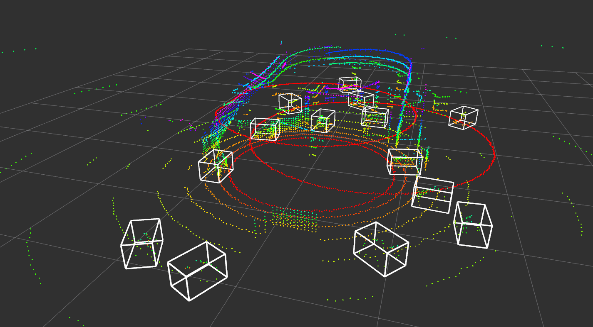

# CRLFnet
[](http://github.com/badges/stability-badges)
[](https://github.com/OrangeSodahub/CRLFnet/actions/workflows/codeql.yml)
[](https://github.com/OrangeSodahub/CRLFnet/actions/workflows/pages/pages-build-deployment)
<!--[](https://codeclimate.com/github/OrangeSodahub/CRLFnet/test_coverage)-->
<!--[](https://codeclimate.com/github/OrangeSodahub/CRLFnet/maintainability)-->
[](https://codecov.io/gh/OrangeSodahub/CRLFnet)


[](https://zenodo.org/badge/latestdoi/477069057)

The source code of the CRLFnet.

## INSTALL & BUILD

**Env:** Ubuntu20.04 + ROS(Noetic) + Python3.x

- If using Google-colab, there is a recommanded environment: **CUDA10.2+PyTorch1.6**. It is proved that **CUDA11.3+PyTorch1.11** is incorrect.
- Please refer to [INSTALL.md](docs/INSTALL.md) for the installation of `OpenPCDet`. Using correct version of CUDA, when a build process occurred errors , before change the version of CUDA and the next build **Delete** the entire `build` folder.
- Install `ros_numpy` package mannually. Source code:    https://github.com/eric-wieser/ros_numpy. How to install: https://blog.csdn.net/mywxm/article/details/121945880

Absolute paths may need your mind:
 | file path                        | Line(s)                               |
 |----------------------------------|---------------------------------------|
 | src/camera_info/get_cam_info.cpp | 26,64,102,140,170,216,254,292,330,368,|
 | src/LidCamFusion/OpenPCDet/tools/cfgs/custom_models/pointrcnn.yaml|5     |
 | src/LidCamFusion/OpenPCDet/tools/cfgs/custom_models/pv_rcnn.yaml|5       |

## Rad-Cam Fusion
### Necessary Configurations on GPU and model data

- If GPU and cuda is available on your device, you can set the parameter `cuda` to `True` in `src/site_model/src/utils/yolo/yolo.py`.

- Please download `yolo_weights.pth` from jbox, and move it to `src/site_model/src/utils/yolo/model_data`.

### Run The Rad-Cam Fusion Model

The steps to run the radar-camera fusion is listed as follows.

For the last command, an optional parameter `--save` or `-s` is available if you need to save the POIs and ROIs as images. The `--trigger` or `-t` parameter controls under what situation to save images. The `--information` or `-i` parameter enables the program to print detailed POI and ROI information while running.

```bash
    cd /ROOT_DIR/

    # load the simulation scene
    roslaunch site_model spawn.launch   # load the site
    roslaunch pkg racecar.launch        # load the vehicle
    rosrun pkg keyboard_teleop.py       # use WASD to control the vehicle

    # run the radar message filter
    python src/site_model/src/tools/radar_listener.py
    
    # run the rad-cam fusion program
    cd src/site_model
    python -m src.RadCamFusion.fusion [-i] [-s] [-t MODE]
```

### Camera Calibration
Two commands are needed for camera calibration after `spawn.launch` is launched. Relative files are already exist in the repository. If the poses of components of models in `.urdf` files haven't been modified, skip this step.

```bash
    rosrun site_model get_cam_info # get relevant parameters of cameras from gazebo
    python src/site_model/src/tools/RadCamFusion/generate_calib.py # generate calibration formula according to parameters of cameras
```

## Lid-Cam Fusion
This part use `OpenPCDet` as the detection tool, refer to [CustomDataset.md](https://github.com/OrangeSodahub/OpenPCDet/blob/master/src/site_model/src/LidCamFusion/OpenPCDet/pcdet/datasets/custom/CustomDataset.md) to find how to train self-product dataset.
### Config Files
Configurations for model and dataset need to be specified:
- **Model Configs** `tools/cfgs/custom_models/XXX.yaml`
- **Dataset Configs** `tools/cfgs/dataset_configs/custom_dataset.yaml`

Now `pointrcnn.yaml` and `pv_rcnn.yaml` are supported.

### Datasets
Create dataset infos before training:
```bash
    cd OpenPCDet/
    python -m pcdet.datasets.custom.custom_dataset create_custom_infos tools/cfgs/dataset_configs/custom_dataset.yaml
```
File `custom_infos_train.pkl`, `custom_dbinfos_train.pkl` and `custom_infos_test.pkl` will be saved to `data/custom`.

### Train
Specify the model using YAML files defined above.
```bash
    cd tools/
    python train.py --cfg_file path/to/config/file/
```
For example, if using PV_RCNN for training:
```bash
    cd tools/
    python train.py --cfg_file cfgs/custom_models/pv_rcnn.yaml --batch_size 2 --workers 4 --epochs 80
```
### Pretrained Model
Download pretrained model through these links:
|model         |time cost       |URL                                                                               |
|--------------|----------------|----------------------------------------------------------------------------------|
|PointRCNN     |~3h             |https://drive.google.com/file/d/11gTjqraBqWP3-ocsRMxfXu2R7HsM0-qm/view?usp=sharing|
|PV_RCNN       |~6h             |https://drive.google.com/file/d/11gTjqraBqWP3-ocsRMxfXu2R7HsM0-qm/view?usp=sharing|

### Predict (Local)
Prediction on local dataset help to check the result of training.
```bash
python pred.py --cfg_file path/to/config/file/ --ckpt path/to/checkpoint/ --data_path path/to/dataset/
```
For example:
```bash
python pred.py --cfg_file cfgs/custom_models/pv_rcnn.yaml --ckpt ../output/custom_models/pv_rcnn/default/ckpt/checkpoint_epoch_80.pth --data_path ../data/custom/testing/velodyne/
```
Visualize the results in rviz like:


### Lid-Cam Fusion
Follow these steps for only lidar-camera fusion. Some of them need different bash terminals.  For the last command, additional parameter `--save_result` is required if need to save the results of fusion in the form of image.
```bash
    cd to/ROOT_DIR/

    roslaunch site_model spawn.launch # start the solid model

    # (generate camera calibrations if needed)

    python src/site_model/src/LidCamFusion/camera_listener.py # cameras around lidars start working

    python src/site_model/src/LidCamFusion/pointcloud_listener.py # lidars start working

    rosrun site_model pointcloud_combiner # combine all the point clouds and fix their coords

    cd src/site_model/
    python -m src.LidCamFusion.fusion [--save_result] # start camera-lidar fusion
```

## Run the whole model
The whole project contains several different parts which need to be start up through commands. Following commands show how to start.
```bash
    cd to/ROOT_DIR/

    source ./devel/setup.bash
    
    roslaunch site_model spawn.launch

    # (generate camera calibrations if needed)

    rosrun site_model src/tools/radar_listener.py
    
    cd src/site_model
    python -m src.RadCamFusion.fusion [--save_result]


    python src/site_model/src/LidCamFusion/camera_listener.py

    python src/site_model/src/LidCamFusion/pointcloud_listener.py

    rosrun site_model pointcloud_combiner

    cd src/site_model/src/LidCamFusion/
    python -m src.LidCamFusion.fusion [--save_result]
```

# Issues
Some problems may occurred during debugging.
- Confused: set the batch_size=1 and still out of memory: https://github.com/open-mmlab/OpenPCDet/issues/140
- 段错误(核心已转储) when run dem.py: https://github.com/open-mmlab/OpenPCDet/issues/846
- N > 0 assert faild. CUDA kernel launch blocks must be positive, but got N= 0 when training: https://github.com/open-mmlab/OpenPCDet/issues/945
- raise NotImplementedError, NaN or Inf found in input tensor when training: https://github.com/open-mmlab/OpenPCDet/issues/280

[](https://wakatime.com/badge/user/55e306c3-cea9-4c2e-9056-61b183dcb26a/project/8aa7cd6e-46d5-4132-baf0-12c0930aa059)
